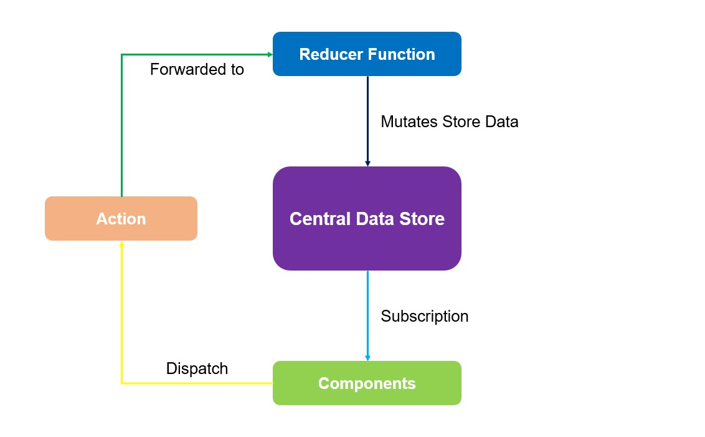

## Redux Concepts

 
 

###  React-Context vs Redux (React-Context의 단점)

- 복잡한 설정과 관리
  - 심하게 중첩된 JSX 코드와 다양하고 많은 Context Provider, 또는 유지하기 어려운 거대한 하나의 Context Provider를 가지게 됨.
- 성능 이슈
  - 고빈도의 상태 변경에는 React Context가 적합하지 않음.

 

#### => 일반적인 상황을 위해 Redux의 도입이 필요하다.

 
 

### Redux

1. 중앙 데이터 저장소 : 전체 애플리케이션의 모든 상태 저장, 컴포넌트 안에서 이를 사용하기 위해 Subscription 설정하여 데이터가 변경되릴 때마다 컴포넌트에 알림
2. 컴포넌트 : 저장소를 구독하여 필요한 데이터를 받음
3. 리듀서 함수 : 저장소 데이터 업데이트, 액션을 받아 새로운 상태를 저장소로 전달, 저장소의 기존 상태 대체
4. 액션 : 컴포넌트가 dispatch하는 특정한 행동, 이를 리듀서로 전달하여 실행

 
 

#### Reducer

Inputs : {Old state + Dispatched Action} => Output : {New State Object} (Pure Function)
